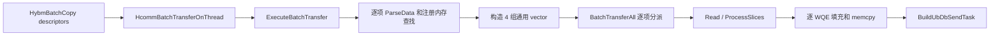

# AICPU UB 离散小包 Batch READ 性能优化说明

- 状态：上板验证前，供代码评审和实验复现
- 日期：2026-08-22
- 适用范围：Ascend 950 legacy AICPU UB 路径、MemFabric_Hybrid `HybmBatchCopy`

## 1. 概要

本次优化针对 Host DRAM 到 NPU HBM 的大量离散 READ。实验表明，当前瓶颈主要是 AICPU 逐 descriptor
准备对象和构造 WQE 的软件开销，而不是总传输字节数、doorbell 次数、Jetty 数量或 channel 数量。

方案保留 `HcommBatchTransferOnThread` 公共接口和非纯 READ fallback，仅为 Ascend 950 AICPU UB 的纯 READ
增加内部快路径：一次准备地址映射、直接批量构造 WQE、删除热路径逐包日志，并由 MemFabric 在每条独立 lane
末尾提交一次 channel fence 和 completion READ，汇合前面的 relaxed READ WQE。

本次没有修改 `BatchOneSidedWrite` 的入口和调用流程，没有新增公共 API，也没有修改 UT 或测试代码。

## 2. 背景与测量结论

### 2.1 端到端现象

前期上板测量得到以下特征：

| 场景 | 数据规模 | 观测时延 |
| --- | --- | --- |
| 离散小包 | 4K 个包 | 约 4 ms |
| 离散小包 | 8K 个包 | 约 8 ms |
| 离散小包 | 16K 个包 | 约 15 ms |
| 离散小包 | 8192 token、K=512、V=64、FP16，约 9 MiB | 约 15 ms |
| 单个大包 | 1 个约 8 MiB 的包 | 约 130 us |

离散小包时延近似按包数线性增长，约为每包 1 us；相近甚至更大的总字节数合并成一个 descriptor 后，
时延下降两个数量级。因此，带宽不是主要矛盾，逐包固定开销才是主要矛盾。

### 2.2 分阶段打点

MemFabric 的单 lane 临时打点显示：

| `kMaxBatchSize` | descriptor 数 | `buildAllWqeNs` | `batchXferTotalNs` | `launchTaskNs` | `completionWaitNs` |
| --- | ---: | ---: | ---: | ---: | ---: |
| 1000 | 16384 | 14.235 ms | 14.227 ms，17 次调用 | 9.460 us | 472.431 us |
| 5000 | 16384 | 15.595 ms | 15.587 ms，4 次调用 | 9.835 us | 426.637 us |

HCOMM 内部代表性打点中，`ExecuteBatchTransfer` 的准备阶段约为 111.9 us，`BatchTransferAll` 的 WQE
构造阶段约为 739.3 us。增大 `kMaxBatchSize` 只减少函数调用和 DB task 数，没有降低总构造时间。

由此得到以下结论：

1. `HcommBatchModeEnd` 逐 ThreadHandle 启动 RTSQ task 的耗时只有微秒级，不是主瓶颈。
2. 一次 `BatchTransferAll` 最后统一构造 DB task，减少 doorbell 不能消除逐 descriptor 的 WQE 构造成本。
3. 增加 Jetty/channel/lane 后端到端时延没有变化，是因为当前 AICPU 仍按 lane 串行调用构造函数；
   `BatchModeStart/End` 只能让已经构造好的任务集中启动，不能并行化 AICPU 上的 WQE 构造循环。
4. 优先优化准备和 WQE 构造的软件路径，比继续调大 batch 或增加 lane 更有价值。

## 3. 原路径及瓶颈

纯 READ 在优化前与混合 batch 共用通用解析路径：



该路径存在以下固定开销：

- 每个 descriptor 都经过通用 transfer type、reduce type、notify 字段解析和分派；
- local/remote 注册内存查找通过通用对象转换完成，remote 查找可能向前遍历 map；
- 纯 READ 仍构造 `RmaBufferLite`、`Buffer`、`TransferOp`、`notifyIdxs` 四组 vector；
- 每个小包都进入通用切片逻辑，并创建临时 slice；
- 构造函数和 WQE 填充函数存在逐 descriptor INFO 日志；
- 每次 `HcommBatchTransferOnThread` 的最后一条 READ 默认使用 strong order、completion order、fence 和 CQE，
  多次分批调用会重复产生强完成边界。

## 4. 详细设计与函数修改

### 4.1 `ExecuteBatchTransfer`：只分流纯 READ

文件：
`src/legacy/ascend950/unified_platform/resource/transport/aicpu/ub_transport_lite_impl.cc`

`IsPureReadBatch` 扫描 descriptor 类型。只有 `transferDescNum > 0` 且全部为
`HCOMM_TRANSFER_TYPE_READ` 时，`ExecuteBatchTransfer` 才进入 `ExecuteBatchRead`；WRITE、reduce、notify 和混合
batch 继续使用原 `ParseData` + `BatchTransferAll` fallback。

该分流没有改变公共 API，也不改变非纯 READ 的行为。快路径失败时返回原 HCOMM 错误码，不静默切换到另一套
有不同部分提交语义的实现。

### 4.2 `FindLocReadSlice` / `FindRmtReadSlice`：单次有界查找

两个函数分别在 `locBufferMap` 和 `rmtBufferMap` 上调用 `upper_bound(addr)`，回退一个迭代器后检查：

1. 地址不小于注册区间起点；
2. 长度不大于注册区间大小；
3. `offset <= buffer.size - size`，避免 `addr + size` 溢出。

查找成功后直接构造轻量 local/remote slice。该实现把每个 descriptor 的查找限制为一次 map 查找，不再创建
通用 `Buffer` 后向前遍历多个注册区间。

### 4.3 `PrepareBatchRead`：一次循环完成准备

`PrepareBatchRead` 只保留纯 READ 必要的数据：

- 为 local 和 remote 两组 slice vector 提前 `reserve(transferDescNum)`；
- 校验 local/remote 指针；
- 分别查找 local tokenId 与 remote tokenId/tokenValue；
- 检查累计字节数溢出；
- 错误日志记录 descriptor index、地址、长度和 map 大小。

不再构造 `TransferOp` 和 `notifyIdxs`，也不执行 reduce 映射表查询。`ExecuteBatchRead` 使用
`EXCEPTION_CATCH` 包住准备调用，避免 `reserve`/`push_back` 的分配异常越过 C API 边界。

### 4.4 `ExecuteBatchRead`：一次批量 WQE 构造和一个 DB task

`ExecuteBatchRead` 的步骤为：

1. 调用 `PrepareBatchRead`；
2. 通过 `SetFenceConfig` 继承调用前显式设置的 channel fence；
3. 仅当所有 descriptor 的 4 字节 `reserved` 都为 `MFEX` 时，设置
   `externalFenceCompletion=true`；
4. 一次调用 `BatchOneSidedRead` 构造本批次全部 WQE；
5. 使用最终 PI 构造一个 `BuildUbDbSendTask`；
6. 仅在 profiling/task exception DFX 实际启用时上报一个聚合 task。

准备、WQE 构造、DB task 和 profiling 回调均有异常边界。临时聚合 timing 日志保留在循环外，避免重新引入
逐 descriptor 打点扰动。

### 4.5 `BatchOneSidedRead`：小包直接进入 WQE 构造

文件：
`src/legacy/ascend950/unified_platform/resource/connection/aicpu/ub_conn_lite.cc`

`BatchOneSidedRead` 不再统一调用 `BatchCommDataProcess`。对于 `size <= maxReadSize` 的常见离散小包，直接调用
`FillBatchOneWqe`；只有大于硬件单 WQE READ 上限的 descriptor 才调用 `BatchProcessOneSlice`。

函数进入时保存 `pi` 和 `piDetourCount`。任一 WQE 构造抛出异常时，恢复两个值并重新抛出，保证一次
`HcommBatchTransferOnThread` 不会返回“失败但 PI 已部分前移”的状态。错误日志包含 slice 数、起始/当前 PI
和 SQ depth。

### 4.6 `FillBatchOneWqe`：直接写 SQ，PI 只在成功后前移

`FillBatchOneWqe` 的主要调整如下：

- `pi` 保持 `u16` 自然增长，`sqOffset = pi % sqDepth_` 只用于选择 SQ ring slot；
- owner 根据实际 ring slot 设置，避免 PI 超过第一圈后失去末 slot 标记；
- 根据 `isLastWqe` 传入 `LAST` 或 `MIDDLE`，使 `FillCommSqe` 的 CQE 逻辑得到正确 slice position；
- WQE 初始化、remote/local 字段填充和 `memcpy_sp` 保持一次完成；
- 只有 `memcpy_sp` 成功后才递增 PI；
- 删除逐 WQE 地址、PI 和字段 INFO 日志；
- `memcpy_sp` 失败日志增加 opcode、PI、slot、depth、local/remote 地址和长度。

### 4.7 `BatchProcessOneSlice`：修复通用大包切片边界

该函数仍用于超过 `maxReadSize`/`maxWriteSize` 的 descriptor。本次修正两个原有边界问题：

- 使用调用者传入的 `maxSliceSize`，不再写死 `UB_DMA_MAX_READ_WEITE_SIZE`；
- 每个 descriptor 都处理 remainder，不再只处理 vector 中最后一个 descriptor 的 remainder。

最后一个 descriptor 的最后一个 WQE 才设置 `isLastWqe=true`。这项修正由 READ 和 WRITE 共享，但
`BatchOneSidedWrite` 本身的入口、循环和完成行为没有改变。

### 4.8 `FillCommSqe` / `CustomizeSqeByOneSidedComm`：区分默认策略和显式策略

`SqeConfigLite` 新增两个内部字段：

| 字段 | 含义 |
| --- | --- |
| `userConfig` | 上层已经明确给出 order/completion/fence，底层切片逻辑不得覆盖 |
| `externalFenceCompletion` | 当前 batch 后续存在强 fence + completion READ，可将数据 READ 尾 WQE 保持 relaxed |

`FillCommSqe` 在 `userConfig=true` 时直接采用上层配置；否则保持原有 ONLY/LAST 强保序策略。
`CustomizeSqeByOneSidedComm` 在普通调用下仍让最后一个 WQE strong；只有
`externalFenceCompletion=true && userConfig=false` 时，当前批次所有数据 READ 才使用 relaxed order、无
completion order、无 fence、无 CQE。

`BatchTransfer`、`BatchTransferAll`、PostFin 和 `SetFenceConfig` 中的 `userConfig=true` 不是快路径冗余代码：
这些函数仍服务 fallback 和非纯 READ 调用。如果不设置，小 descriptor 会被识别为 ONLY slice，底层重新覆盖为
strong/fence，导致上层配置失效。该行为与 HCOMM 已有小数据性能修复的语义一致。

### 4.9 热路径日志和 profiling

以下高频日志已删除或跳过：

- local/remote slice 构造函数的对象描述日志；
- `FillLocalSgeSqe`、`FillBatchOneWqe` 和原 `CustomizeSqeByOneSidedComm` 的逐 WQE INFO 日志；
- profiling 未启用时，`ExecProfiling`/`ExecProfilingAll` 立即返回，不再遍历全部 descriptor 计算总长度。

错误路径仍保留 ERROR 日志和定位参数。当前 `[TEMP_TIMING]` ERROR 日志仅用于上板阶段，应在完成数据采集后
删除或改为受控 DFX 开关，避免常态 ERROR 噪声。

### 4.10 MemFabric `HybmBatchCopy` 配套修改

文件：
`MemFabric_Hybrid/src/acc_offload/csrc/operators/aicpu/hybm_batch_copy.cc`

`ResolveAndAppendItem` 为每个 READ descriptor 的 4 字节 `reserved` 写入 `MFEX`。HCOMM 只有在“全部纯 READ +
全部 4 字节精确匹配”时才启用外部完成模式，避免旧调用方未初始化 reserved 时误触发。

每条 lane 的提交顺序保持为：

```text
多个 HcommBatchTransferOnThread
    -> HcommChannelFenceOnThread
    -> HcommReadOnThread(remote completion flag -> local completion cell)
```

所有 lane 都在同一个外层 `HcommBatchModeStart/End` 内构造任务。每条 lane 使用独立 Thread、Stream、Channel、
Connection/Jetty 和 completion cell，绝不跨 lane 共享 Channel。AICPU 在 `BatchModeEnd` 后轮询每条 lane 的
completion cell；最终 completion READ 完成意味着同一 lane 中它前面的 relaxed READ 已被强操作汇合。

`SubmitLaneCompletions` 会尝试为所有目标 lane 提交完成操作，并返回首个错误。若某个 lane 的 descriptor 分批
提交在中途失败，错误路径会为之前成功 lane 和当前可能已部分成功的 lane 尽力补交 fence/completion，再调用
`BatchModeEnd`，避免已构造的 relaxed WQE 在没有最终强汇合操作的情况下被启动。

## 5. 完成与保序语义

本次优化放宽的是同一 lane 内离散数据 READ 之间不必要的逐批 strong 边界，不是删除最终完成保证。

1. `HcommBatchTransferOnThread`、`HcommChannelFenceOnThread` 和 `HcommReadOnThread` 在 AICPU 侧先构造 WQE/RTSQ
   task；它们本身不在接口返回前等待链路传输完成。
2. `HcommBatchModeEnd` 将各 ThreadHandle 已缓存的 RTSQ task 提交给硬件执行。
3. 同一 lane 的最终 strong fence/completion READ 不能越过前面的 relaxed READ。
4. MemFabric AICPU 算子轮询 completion cell，只有最终 READ 已写回本地标志后才返回。
5. Host 侧后续 `synchronizeStream` 仍是整个 stream 的外部同步边界，但在当前实现中，AICPU 算子自身已经等待
   completion cell，因此两者的 profiling 时长接近是合理现象。

不同 lane 之间不提供顺序关系。本场景的离散 K/V block 彼此独立，不要求跨 descriptor 保序；数据正确性由每个
目标区间最终内容和每 lane 完成标志保证。

## 6. 兼容性与 fallback

- 没有修改 `HcommBatchTransferOnThread` 的函数签名或 `HcommBatchTransferDesc` 布局；`MFEX` 使用现有保留字段。
- 旧 HCOMM 会忽略 MemFabric 写入的 reserved 字段，继续使用原逐 batch 强尾 WQE，功能不受影响。
- 新 HCOMM 遇到未携带 `MFEX` 的调用方时，`externalFenceCompletion=false`，保留原最后 WQE strong/fence/CQE。
- 混合 transfer type、WRITE、reduce 和 notify 全部走原 `BatchTransferAll` 路径。
- `BatchOneSidedWrite` 没有新增快路径或 relaxed 外部完成协议。
- 当前协议是两个仓之间的内部实验约定，不应作为稳定公共 ABI 对外承诺。

## 7. 全局审查结果

本轮静态审查重点覆盖纯 READ 快路径、通用 fallback、order/completion、PI/ring、异常和部分提交路径，结论如下：

| 检查项 | 结论 |
| --- | --- |
| 非纯 READ 路径 | 保留，除已有 `userConfig` 修复和 profiling gate 外不改变分派 |
| `BatchOneSidedWrite` | 入口和主流程未修改；仅共享大包切片边界修正生效 |
| 非整除大包 | remainder 对每个 descriptor 生效，最后 WQE 标记正确 |
| PI 更新 | `memcpy_sp` 成功后更新；批量异常恢复 PI 和 detour count |
| ring slot/owner | slot 使用 `pi % sqDepth_`；PI 保持自然 `u16` doorbell 值 |
| 外部完成启用条件 | 纯 READ 且每个 descriptor 的 4 字节 magic 全匹配 |
| 正常完成 | 每 lane 独立 fence + completion READ + completion cell 等待 |
| 部分提交失败 | 为所有已触达 lane 尽力补交强完成，再结束 BatchMode |
| C++ 异常边界 | 准备、WQE、DB task、profiling 均不会把异常传出 C API |
| 错误日志 | 新增错误返回点有 ERROR 日志和 descriptor/lane/地址/PI 等关键参数 |
| 热路径日志 | 未恢复逐 descriptor/WQE INFO 日志 |

未发现对现有成功流程的确定性功能回归。仍需通过目标硬件验证第 8 节列出的 SQ 环回、完成语义和数据正确性。

### 7.1 本地静态与构建检查

本地完成了差异级静态检查：HCOMM 变更使用仓库指定的 clang-format 16 格式化，MemFabric 变更通过仓库
clang-format 18.1.8 hook；两个仓库的 `git diff --check`、新增 C/C++ 行宽检查和变更路径检查均通过，未修改
UT、ST 或测试文件。

本机不具备完整目标编译环境，因此不能声明编译或运行验证通过：

- HCOMM 构建在配置阶段失败，当前 `C:/code/cann` 不是可用的 CANN 安装目录，缺少 `set_env.sh`；Windows
  CMake 同时选择了不可用的 NMake generator；
- MemFabric wrapper 构建在编译前失败，本机未设置 `ASCEND_HOME_PATH`，且既有 `build` 目录被占用；
- 按本次任务约束未运行 UT、ST 和性能测试，也没有目标 NPU 硬件结果。

上板时应使用第 8 节命令在完整 CANN/NPU 环境重新构建，并把正确性、SQ 环回和 profiling 结果作为最终合入依据。

## 8. 上板验证方案

### 8.1 构建和部署

HCOMM 需要使用目标 CANN 安装目录构建，示例：

```bash
cd <hcomm_repo>
bash build.sh --pkg -p "${ASCEND_HOME_PATH}" --build-type=Release -j8
```

MemFabric local DRAM 验证路径需要显式打开：

```bash
cd <memfabric_hybrid_repo>
bash script/build_and_pack_run.sh --build_local_dram_validation ON
```

### 8.2 先验证正确性

性能脚本使用 `torch_npu.profiler.profile`，每轮结束会把 K/V 拷回 CPU 并逐字节校验。建议至少覆盖：

| 目的 | 参数 |
| --- | --- |
| 默认双组件 | `--token-count 8192 --k-dim 512 --v-dim 64` |
| 只拷 Key | `--token-count 8192 --k-dim 512 --v-dim 0` |
| 非整除 lane/batch | `--token-count 8193 --k-dim 512 --v-dim 64` |
| 单 descriptor 大包 | `--token-count 1 --k-dim 8388608 --v-dim 0` |
| 单卡调试 | `--cards 0` |
| 多卡并发 | 选择 2 至 8 张可用卡，例如 `--cards 0,1,2,3` |

每组都检查：无 data mismatch、无 completion timeout、无 channel 状态错误、无 PI/SQ 异常，并核对
`externalFence[1]` 只出现在携带 `MFEX` 的纯 READ 数据批次，最终 completion READ 应使用显式强配置。

### 8.3 1/2/4 lane profiling 对比

```bash
PROFILE_DIR=/tmp/mf-urma-card-profiling
for lanes in 1 2 4; do
  python3 examples/kv_offload/sparse_copy_urma/03_host_device_urma_performance.py \
    --cards 0 \
    --env-dir "${ENV_DIR}" \
    --profiling-dir "${PROFILE_DIR}" \
    --head-ip 127.0.0.1 \
    --token-count 8192 \
    --k-dim 512 \
    --v-dim 64 \
    --batch-copy-lanes "${lanes}"
done
```

对比时固定数据规格、build type、日志级别、卡频率和 profiler 配置，分别记录：

- AICPU 算子时长；
- `buildAllWqeNs`、`batchXferTotalNs`、单次最大 batch 构造时长；
- `launchTaskNs` 与 `completionWaitNs`；
- HCOMM `prepareNs`、`wqeBuildNs`、`buildDbTaskNs`；
- NPU timeline 上实际数据传输和 stream synchronize 边界。

当前 1/2/4 lane 均约 15 ms 的历史结果应作为对照，不预设本次代码一定达到某个时延目标。

### 8.4 SQ 环回专项

需要选择能让累计 WQE 数跨越 `sqDepth_`、并尽可能覆盖 `u16` PI 环回的长时间重复场景，确认：

- ring 末 slot 的 owner 正确；
- 多次 `HcommBatchTransferOnThread` 共处一个 BatchMode 时不会覆盖尚未消费的 WQE；
- SQ 可用空间不足时有明确反压或错误，而不是静默破坏数据；
- completion READ 不会提前于任何数据 READ 完成。

## 9. 已知限制与风险

| 风险 | 影响 | 当前措施 |
| --- | --- | --- |
| `MFEX` 使用 reserved 字段 | 两仓存在私有协议耦合 | 4 字节全匹配、仅纯 READ 生效、旧版本安全 fallback |
| 外部完成调用失败 | 部分数据 WQE 可能已经构造 | 尽力为所有已触达 lane 补交完成并统一结束 BatchMode |
| 一个 BatchMode 累计 WQE 超过 SQ 深度 | 未消费 WQE 可能被覆盖 | 上板专项验证；后续增加 CI/可用空间检查和分段 launch |
| PI 的 `u16` 环回缺少本机硬件验证 | 长时间运行可能暴露 owner/doorbell 问题 | 上板覆盖跨 depth 和跨 65536 PI 场景 |
| 聚合 profiling 用最后地址加总长度 | 离散地址的 DFX 表达不精确 | 性能统计可用；后续改为 descriptor-aware DFX |
| 临时 ERROR timing 日志 | 日志噪声并可能扰动测量 | 数据采集完成后删除或改为开关控制 |
| 多 lane 构造仍在一个 AICPU 调用中串行 | lane 数增加不降低 WQE build 时间 | 下一阶段需要真正并行构造或硬件批量描述符能力 |

## 10. 下一步优化方向

建议按以下优先级推进，且先以本次上板数据决定是否实施：

### P0：完成硬件闭环

1. 完成第 8 节正确性、PI/SQ 环回、1/2/4 lane 和不同包数的 profiling。
2. 验证 relaxed READ 的硬件 outstanding 数是否增加，最终 fence 是否确实汇合全部 READ response。
3. 验证完成后移除临时 ERROR timing 日志，保留必要错误日志。

### P1：继续降低 AICPU 每 descriptor 软件成本

1. 让纯 READ 准备阶段直接写入预分配 slice 缓冲，或复用 transport 内部 vector capacity，减少每次分配。
2. 缓存注册内存区间命中结果；如果一批地址位于相同注册区间，避免每个 descriptor 重复 `upper_bound`。
3. 将 local/remote 地址、token 和 WQE 固定字段的填充进一步合并，评估预取、批量 `memcpy` 或直接顺序写 SQ。
4. 若相邻 descriptor 的 local 与 remote 地址都连续，则在 MemFabric 分组后合并为更大 descriptor，从源头减少 WQE 数；
   地址不连续时不得强行合并。

### P2：解决 WQE 数量本身的线性成本

1. 调研 UB/URMA 是否支持一个 WQE 携带多个 SGE、gather/scatter list 或 provider 级 batch post；如果硬件只支持
   当前单 SGE READ，则软件无法消除 N 个离散包对应 N 个 WQE 的下限。
2. 获取 SQ issue rate、READ outstanding、response/completion、链路利用率和 backpressure 计数，区分“CPU 构造串行”
   与“硬件每 WQE 串行处理”。
3. 若要用多 lane 降低构造时间，必须让不同 AICPU Thread 真正并行执行各自 WQE 构造；当前在一个算子函数中
   依次调用 lane 的方式只并发启动传输，不能并行准备。多个线程不得共享同一个 Channel/Jetty/SQ。

### P3：产品化接口与 DFX

1. 用正式的 descriptor flag 或专用 Batch READ API 替代 `reserved="MFEX"` 私有约定，并明确调用方必须提供的最终
   completion/fence 合约。
2. 为离散 batch 增加 descriptor-aware profiling 表达，避免用最后地址和累计长度模拟连续区间。
3. 在 HCOMM 内增加 SQ capacity/CI 检查和可控分段 launch，给超深 batch 明确反压语义。

## 11. 评审关注点

评审时建议重点确认：

1. `MFEX` 的启用条件和最终强完成合约是否足够严格；
2. relaxed/strong/fence/CQE 字段组合是否与目标 UB 硬件语义一致；
3. PI、owner、SQ depth 和多次 DB task 的环回行为；
4. 部分提交失败时的完成补偿是否满足资源生命周期要求；
5. 纯 READ 快路径之外的 WRITE/reduce/notify fallback 是否完全保持原语义；
6. 上板数据是否证明 WQE 构造时延下降，以及剩余瓶颈位于 AICPU 还是 UB/URMA 硬件执行。
